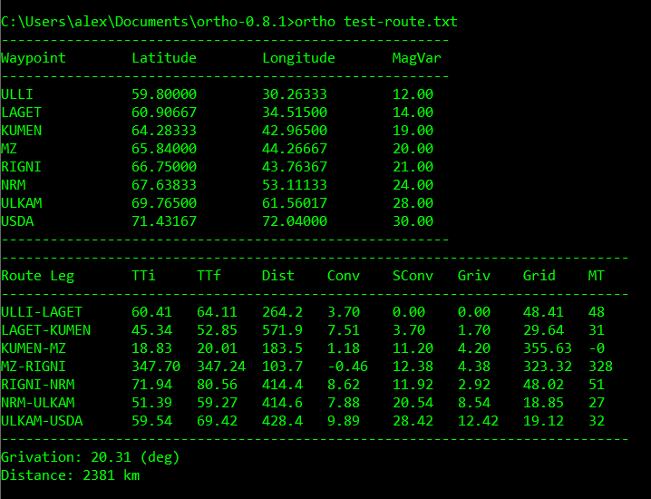
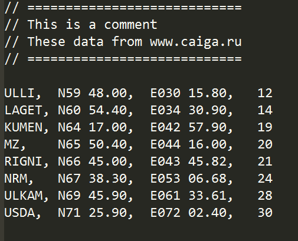
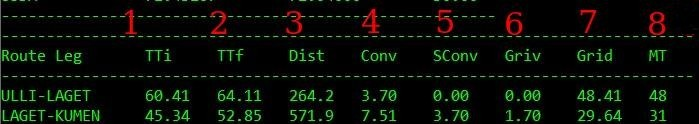

# ORTHODROMY

This program is designed to calculate the navigation elements of flight which 
performed with using gyroscopic gauges  along the orthodrome (arc of a great 
circle).  **This program is intended for use only in the computer game 
"flight simulator"**.  It should not be used for any practical goals other 
than entertainment and educational purposes. 

This is a *console* program which can be run from Windows (or Linux) command 
line. A simple text may be used as a route file. The file should hold names and
 coordinates the route waypoints.

The program calculates orthodromic angles and distances based on spherical 
geometry formulas.  There is no practical need for more precise calculations on 
the surface of the ellipsoid.

This README file contains only basic information about the program. 
The theoretical and mathematical foundations of this program are described in 
a separate article.  You can also find examples of using this program.

## Input and Output

An example of launch the program is presented on the screenshot below

And this is an example of route file

This file consists coordinates of waypoints which may be taken from the PMDG
navigation database or from other air navigation sources (for example 
enroute maps). 

The program calculates orthodromic courses (grid courses) for given route and 
orthodromic distance (great circle distance) between waypoints of the route. 
For each route leg the program displays the next values: 

 1. initial true course;
 2. final true course;
 3. orthodromic distance;
 4. convergence of geographic (true) meridians;
 5. the sum of convergeces;
 6. grivation of the leg;
 7. grid course;
 8. magnetic course.

Also total distance and total accumulative grivation are displayed. 

Some special terms and definitions are used here. For example: 

*Grivation* (or grid variation) is an angle between grid north and magnetic north.

*Grid course* (or orthodromic course) is an angle between the north direction of reference meridian and desired track. 

Other terms can be found  at separated article.

## License

This program is distributed completely freely under GPL3 License. You can change
it as you want. This program can be compiled for both Windows and Linux. It is 
checked and tested for both operating systems. I carefully checked the program 
code. However, some errors are probably present. I would be grateful for your 
help in detecting and correcting them.

